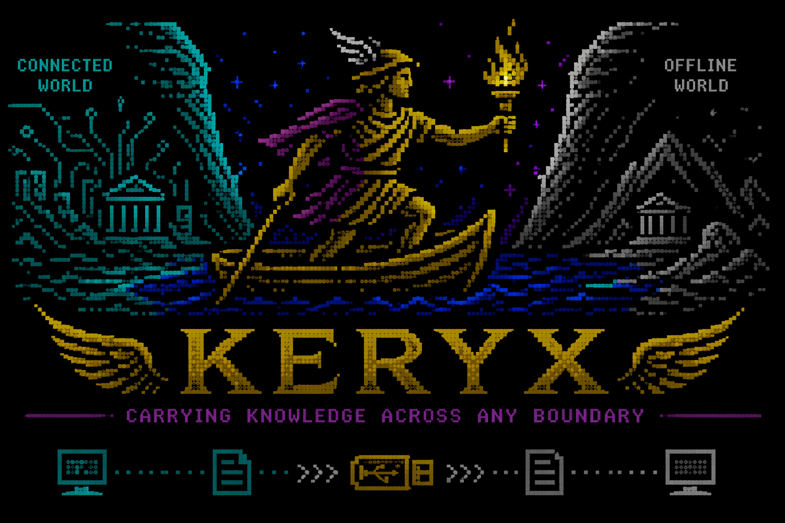

# Keryx

<p align="center">
  
</p>

Portable, human-readable memory for AI agents, backed by your Obsidian vault.

Keryx is for people who already use Obsidian as their second brain and want Claude Code, Codex, Hermes Agent, OpenClaw, and future MCP clients to work against the same durable knowledge base.

Most agent systems leave you with three bad options:

- rely on shallow agent-native memory
- stand up a separate memory stack
- give the agent direct access to your Obsidian files

Keryx takes a different approach:

- Obsidian remains the canonical source of truth
- SQLite stores only derived index and audit state
- a thin local service exposes safe reads and writes
- HTTP and MCP make the interface portable across agent systems

Building an agent integration? Start with [`AGENT_INTEGRATION.md`](AGENT_INTEGRATION.md).
Working with Hermes specifically? See [`HERMES_SETUP.md`](HERMES_SETUP.md).

## How To Think About Keryx

Keryx should not be conceptualized as only a project-memory tool.

Project context is the first mature stitched view in the current implementation, but the broader design is a context-oriented memory interface over an Obsidian vault.

The durable memory substrate includes:

- episodic memory such as daily notes, transcripts, and session notes
- operational memory such as projects, dashboards, tasks, and decisions
- semantic memory such as concepts, research notes, references, and clippings
- procedural memory such as system docs, templates, and workflows
- historical memory such as archives and prior completed work

That means the real product thesis is:

- Obsidian is the canonical knowledge substrate
- Keryx is the governed machine interface over that substrate
- projects are one important retrieval lens, not the ontology

## Why This Exists

Keryx is not trying to replace agent-native memory.

It exists because agent-native memory is usually shaped around one runtime. That is fine for short-lived convenience, but weak when you want your projects, decisions, session notes, and reusable concepts to survive changes in tools.

Keryx is better when you want:

- one durable memory layer shared by Claude Code, Codex, Hermes, OpenClaw, and future MCP clients
- human-readable storage in markdown and YAML, not a closed provider-specific memory store
- safe structured writes instead of unconstrained vault edits
- local control, local auditability, and Git-friendly backups

## Why Not Just Use Hermes Or OpenClaw Memory

Hermes and OpenClaw both have useful built-in memory features. Keryx is not competing with them on their own terrain.

Use those systems when you want memory optimized for that runtime.

Use Keryx when you want memory that outlives the runtime:

- the durable store is your Obsidian vault
- the interface is agent-agnostic
- the same project context can be resumed by a different tool tomorrow
- your memory remains inspectable and editable by a human

The intended model is often tandem, not replacement:

- the agent keeps its own short-term working memory
- Keryx holds the durable long-term project memory

## Why Not Give Agents Direct Obsidian Access

Direct filesystem or CLI access is flexible, but too unconstrained to be the default memory interface.

Keryx adds:

- retrieval over indexed notes and chunks
- stable HTTP and MCP tool contracts
- write policies and managed sections
- local audit logging
- a portability layer that survives tool changes

## Architecture

Keryx is deliberately thin.

- Obsidian vault: canonical human-readable knowledge
- SQLite: derived index, retrieval metadata, and audit log
- Keryx service: constrained reads, retrieval, and governed writes
- HTTP and MCP: portable interface for agents and scripts

The implementation is built around plain markdown, YAML frontmatter, SQLite indexing, constrained writes, and agent-safe interfaces.

Today the richest stitched context surface is `get_project_context`. Longer term, the architecture is aimed at broader context packs that can cover areas, daily activity, topics, procedures, and archive/history as first-class retrieval units.

## What It Includes

- Obsidian vault parser for markdown, YAML frontmatter, headings, tasks, links, and managed regions
- SQLite metadata store with FTS5 keyword search and local audit logging
- deterministic local semantic backend with hybrid ranking
- guarded write flows for capture, decision notes, tasks, summary generation, note linking, and inbox promotion
- FastAPI app for localhost HTTP access
- MCP server with tools and resources
- polling filesystem watcher for incremental re-indexing
- Typer CLI for admin operations

## Typical Agent Workflow

1. If a project is already known, call `get_project_context(project, mode="agent")`.
2. If the task is broader than a single project, start with `search_notes` and `list_recent_notes` to reconstruct the right context from areas, daily notes, references, or system docs.
3. Open the highest-value notes with `open_note`.
4. Work in code or other tools.
5. Persist durable findings with `append_session_note`.
6. Persist important choices with `create_decision`.
7. Persist follow-up work with `create_task`.

That gives you retrieval-first behavior and durable memory without coupling the knowledge system to one agent runtime.

## Quick Start

```bash
make install
cp config.example.yaml local.config.yaml
cp .env.example .env
make test
make index
make serve
make mcp
```

Preferred CLI name:

- `keryx`

Compatibility CLI name still supported:

- `knowledge-gateway`

Defaults:

- HTTP: `http://127.0.0.1:8765`
- MCP: `http://127.0.0.1:8001/mcp`

## launchd

Install persistent macOS user services for the API and MCP servers:

```bash
make install-launchd
```

This writes user-local plists into `~/Library/LaunchAgents/` and starts:

- `io.keryx.api`
- `io.keryx.mcp`

## Docs

- Repo agent instructions: [`AGENTS.md`](AGENTS.md)
- Agent integration guide: [`AGENT_INTEGRATION.md`](AGENT_INTEGRATION.md)
- Context model: [`docs/CONTEXT_MODEL.md`](docs/CONTEXT_MODEL.md)
- Architecture decisions: [`docs/adr/`](docs/adr)
- Security and privacy: [`SECURITY.md`](SECURITY.md)
- Hermes setup: [`HERMES_SETUP.md`](HERMES_SETUP.md)
- Architecture notes: [`ARCHITECTURE.md`](ARCHITECTURE.md)
- Operations: [`OPERATIONS.md`](OPERATIONS.md)
- Existing vault migration notes: [`MIGRATION.md`](MIGRATION.md)
- Templates: [`templates/`](templates)
- Hermes skill: [`skills/hermes-keryx/SKILL.md`](skills/hermes-keryx/SKILL.md)
- Project MCP config example: [`.mcp.json`](.mcp.json)
- MCP client examples: [`examples/mcp-clients.md`](examples/mcp-clients.md)
